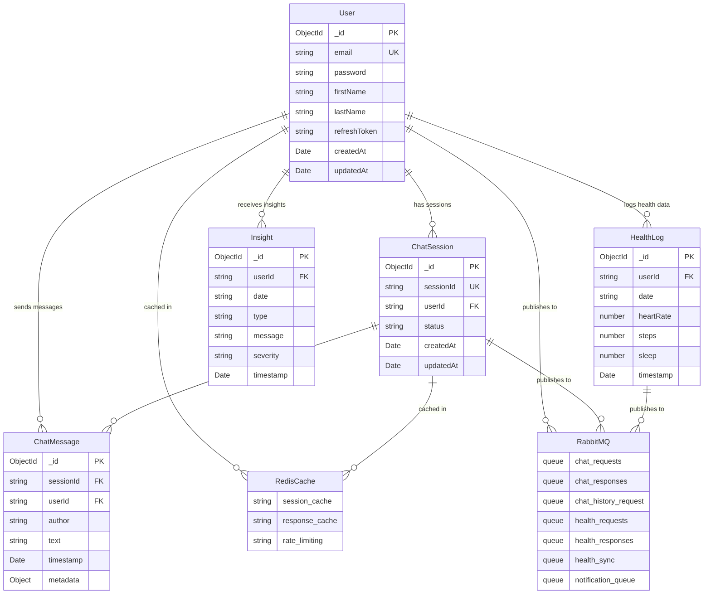

# Healify Database Schema - Microservices Architecture

## Architecture Overview

The system uses a **microservices architecture** where each microservice maintains its own MongoDB database and communicates via **RabbitMQ** for async messaging and **Redis (Upstash)** for caching.

- **Main Service**: User management and authentication
- **Chat Microservice**: AI chat sessions and messages with independent database
- **Health Microservice**: Health metrics and insights with independent database
- **Notification Microservice**: Push notifications (no database, stateless)
- **RabbitMQ**: Async message broker for inter-service communication
- **Redis (Upstash)**: Centralized caching layer for sessions and responses

---

## Performance Optimization

### Recommended Database Indexes

> [!IMPORTANT]
> Apply these indexes to improve query performance. Index creation may temporarily lock collections.

#### Main Service - Users Collection
```javascript
// Create in MongoDB shell or via Mongoose schema
db.users.createIndex({ email: 1 }, { unique: true });
db.users.createIndex({ createdAt: -1 });
```

#### Chat Microservice
```javascript
// Session lookups by user
db.chatsessions.createIndex({ userId: 1, createdAt: -1 });
db.chatsessions.createIndex({ sessionId: 1 }, { unique: true });

// Message retrieval by session
db.chatmessages.createIndex({ sessionId: 1, timestamp: -1 });
db.chatmessages.createIndex({ userId: 1, timestamp: -1 });
```

#### Health Microservice
```javascript
// Daily health log lookups
db.healthlogs.createIndex({ userId: 1, date: -1 });
db.healthlogs.createIndex({ userId: 1, date: 1 }, { unique: true });

// Insight queries
db.insights.createIndex({ userId: 1, timestamp: -1 });
db.insights.createIndex({ userId: 1, severity: 1 });
```

### Caching Strategy

| Data Type | Cache Key Pattern | TTL | Invalidation |
|-----------|------------------|-----|--------------|
| Chat Session | `chat:session:{sessionId}` | 1 hour | On session complete |
| AI Response | `chat:response:{sessionId}` | 1 hour | On new message |
| Health Activity | `health:{userId}:activity` | 5 min | On sync |
| Heart Rate | `health:{userId}:heart-rate` | 5 min | On sync |
| Sleep Data | `health:{userId}:sleep` | 5 min | On sync |
| Rate Limit | `ratelimit:{key}` | Variable | Auto-expire |

### Connection Pooling

```javascript
// MongoDB connection options (Main Server)
{
  maxPoolSize: 50,      // Max connections in pool
  minPoolSize: 10,      // Keep connections warm
  serverSelectionTimeoutMS: 10000,  // 10s faster failure
  connectTimeoutMS: 10000,
  socketTimeoutMS: 45000,
  retryWrites: true,
  retryReads: true,
}
```

---


## Main Service Database

### Users Collection

```typescript
{
  _id: ObjectId,
  email: string (unique, required),
  password: string (hashed, required),
  firstName: string (required),
  lastName?: string,
  refreshToken?: string (hashed),
  createdAt: Date (auto),
  updatedAt: Date (auto)
}
```

**Purpose**: User authentication and profile management

**Key Features**:
- Email-based authentication with bcrypt password hashing
- JWT refresh tokens stored as hashed values
- Timestamps managed by Mongoose

---

## Chat Microservice Database

### ChatSession Collection

```javascript
{
  _id: ObjectId,
  sessionId: string (unique, indexed, required),
  userId: string (indexed, required),
  status: enum ['active', 'completed', 'archived'],
  isBookmarked: boolean (default: false, indexed),
  bookmarkedAt: Date (optional),
  createdAt: Date (default: now),
  updatedAt: Date (default: now)
}
```

**Purpose**: Track chat sessions for users with bookmark capability

**Key Features**:
- Users can bookmark important conversations
- `isBookmarked` indexed for fast bookmark queries
- `bookmarkedAt` tracks when conversation was bookmarked

### ChatMessage Collection

```javascript
{
  _id: ObjectId,
  sessionId: string (indexed, required),
  userId: string (required),
  author: enum ['user', 'ai'] (required),
  text: string (required),
  timestamp: Date (default: now),
  metadata: Object // confidence, model version, etc.
}
```

**Purpose**: Store all chat messages (user and AI responses)

---

## Health Microservice Database

### HealthLog Collection

```javascript
{
  _id: ObjectId,
  userId: string (indexed, required),
  date: string (YYYY-MM-DD, indexed, required),
  heartRate?: number,
  steps?: number,
  sleep?: number, // hours
  timestamp: Date (default: now)
}
```

**Purpose**: Daily health metrics tracking

### Insight Collection

```javascript
{
  _id: ObjectId,
  userId: string (indexed, required),
  date: string (required),
  type: string (required), // e.g., 'HEART_RATE_TREND', 'ACTIVITY_DROP'
  message: string (required),
  severity: enum ['INFO', 'WARNING', 'CRITICAL'],
  timestamp: Date (default: now)
}
```

**Purpose**: Health insights and alerts generated from vitals analysis

---

## Entity Relationship Diagram



---

## Redis (Upstash) Usage

Redis is used **exclusively for caching**, not for message queuing:

### Cache Keys

- `chat:session:{sessionId}` - Chat session data with status
- Generic key-value caching with TTL support
- Rate limiting counters

### Features

- **Session Caching**: Active chat sessions with 1-hour TTL
- **Response Caching**: AI responses for quick retrieval
- **Rate Limiting**: Request throttling per user/IP
- **No Pub/Sub**: RabbitMQ handles all async messaging

---

## RabbitMQ Message Broker

All inter-service communication uses RabbitMQ queues:

### Queue Structure

| Queue Name | Producer | Consumer | Purpose |
|------------|----------|----------|---------|
| `chat_requests` | Main Server | Chat Microservice | AI chat processing requests |
| `chat_responses` | Chat Microservice | Main Server | AI responses delivery |
| `chat_history_request` | Main Server | Chat Microservice | Fetch chat history (RPC) |
| `health_requests` | Main Server | Health Microservice | Health data requests (RPC) |
| `health_responses` | Health Microservice | Main Server | Health data responses |
| `health_sync` | Main Server | Health Microservice | Sync health data from mobile |
| `notification_queue` | Health Microservice | Notification Microservice | Push notifications |

### Communication Patterns

- **Fire-and-Forget**: `chat_requests`, `health_sync`, `notification_queue`
- **RPC (Request-Reply)**: `health_requests` ↔ `health_responses` (with correlationId)
- **History Fetch**: `chat_history_request` with temporary reply queue

---

## Inter-Service Communication Flow

### Chat Flow
1. **Main Server** receives chat message → Publishes to `chat_requests` queue
2. **Chat Microservice** consumes → Processes with AI → Saves to ChatMessage DB
3. **Chat Microservice** publishes to `chat_responses` queue
4. **Main Server** consumes response → Caches in Redis
5. **Mobile App** polls `GET /chat/session/:sessionId` → Retrieves from Redis cache

### Health Sync Flow
1. **Mobile App** sends health data → **Main Server** publishes to `health_sync` queue
2. **Health Microservice** consumes → Saves to HealthLog DB
3. **Health Microservice** analyzes vitals → Generates Insights
4. If abnormal: Publishes to `notification_queue`
5. **Notification Microservice** sends push notification via FCM

### Health Request Flow (RPC)
1. **Main Server** publishes to `health_requests` with correlationId
2. **Health Microservice** consumes → Fetches from HealthLog DB
3. **Health Microservice** publishes to `health_responses` with correlationId
4. **Main Server** awaits response (5s timeout) → Returns to mobile app

---

## Data Consistency Strategy

### Database Isolation
- Each microservice owns its database
- No direct database access between services
- Communication only via RabbitMQ

### Eventual Consistency
- Health insights generated asynchronously
- Chat responses delivered via polling
- Notifications sent asynchronously

### Cache Invalidation
- Redis cache has TTL (1 hour for sessions)
- No cache invalidation events needed
- Stale data acceptable for short periods

---

## Scalability Considerations

- **Horizontal Scaling**: Each microservice can scale independently
- **Database Sharding**: MongoDB supports sharding by userId
- **Queue Partitioning**: RabbitMQ can partition queues for load distribution
- **Cache Distribution**: Redis/Upstash handles distributed caching
- **Stateless Services**: All microservices are stateless (except databases)


## Architecture Overview

The system uses a **microservices architecture** where each microservice maintains its own database and communicates via **Redis** for caching and message queuing.

- **Main Service**: User management and health data
- **Chat Microservice**: AI chat sessions and invitations with independent database
- **Redis**: Centralized caching layer and async communication

---

## Main Service Database

```mermaid
erDiagram
    users {
        string id PK
        string displayName
        string email
        string password
        string firstName
        string createdAt
        string updatedAt
    }

    UserHealthData {
        string id PK
        string userId FK
        number height
        number weight
        string bloodType
        string allergies
        string medications
        string medicalHistory
        string lastCheckup
    }

    UserPreferences {
        string id PK
        string userId FK
        number age
        string relationshipStatus
        string workStatus
        string workType
        string sports
        string hobbies
        string therapyGoals
        string preferredCommunication
    }

    Chat {
        string id PK
        string userId FK
        number duration
        timestamp startedAt
        timestamp endedAt
        string sessionType
        string moodBefore
        string moodAfter
        string summary
    }

    AIResponse {
        string id PK
        string chatId FK
        string question
        string response
        timestamp createdAt
        string modelUsed
        number confidenceScore
    }

    Invite {
        string inviteId PK
        string inviterId FK
        string inviteeId FK
        string type
        string status
        timestamp sentAt
        timestamp respondedAt
    }

    UserActivity {
        string id PK
        string userId FK
        date date
        number steps
        number caloriesBurned
        number activeMinutes
        number distance
        number floors
        string stressLevel
        number bodyBattery
    }

    UserVitals {
        string id PK
        string userId FK
        timestamp recordedAt
        number heartRate
        number restingHeartRate
        number minHeartRate
        number maxHeartRate
        number avgHeartRate
    }

    UserSleep {
        string id PK
        string userId FK
        date date
        number totalDuration
        number deepSleepDuration
        number lightSleepDuration
        number remSleepDuration
        number sleepQuality
        timestamp bedtime
        timestamp wakeTime
    }

    redis {
        string users:cache
        string chat:sessions
        string invites:pending
        string auth:tokens
        string health:cache
        string ai:models
    }

    users ||--|| UserHealthData : "has health data"
    users ||--|| UserPreferences : "has preferences"
    
    users ||--o{ Chat : "initiates"
    Chat }o--|| users : "belongs to"
    
    users ||--o{ Invite : "sends as inviter"
    Invite }o--|| users : "inviter"
    
    users ||--o{ Invite : "receives as invitee"
    Invite }o--|| users : "invitee"
    
    Chat ||--o{ AIResponse : "generates"
    AIResponse }o--|| Chat : "belongs to"

    users ||--o{ UserActivity : "logs"
    users ||--o{ UserVitals : "tracks"
    users ||--o{ UserSleep : "records"
    
    users ||--o{ redis : "cached in"
    redis }|--|| users : "cache for"
    
    UserHealthData ||--o{ redis : "cached in"
    redis }|--|| UserHealthData : "cache for"
    
    Chat ||--o{ redis : "active sessions in"
    redis }|--|| Chat : "session cache for"
    
    Invite ||--o{ redis : "pending in"
    redis }|--|| Invite : "cache for"
```

### Redis Usage

- **Session Management**: Storing active chat sessions and user sessions
- **Authentication Tokens**: JWT tokens and refresh tokens
- **Real-time Health Data**: Caching latest vitals and activity metrics
- **AI Response Cache**: Frequently accessed AI responses
- **Rate Limiting**: Request throttling and API limits
- **Distributed Locks**: Preventing race conditions across services

---

## Inter-Service Communication

- **Main Service** → **Chat Microservice**: Validates user and health context via Redis cache
- **Chat Microservice** → **Main Service**: Fetches user health data for personalized AI responses
- **Both Services**: Publish events to Redis pub/sub for real-time synchronization

### Message Queue Topics

- `chat.started` - When a new AI therapy session begins
- `chat.ended` - When a chat session ends
- `health.updated` - When vitals or activity data is updated
- `invite.sent` - When an invitation is sent
- `invite.accepted` - When an invitation is accepted
- `ai.response.cached` - When AI response is cached for reuse

---

## Data Flow Example

1. **User opens app** → Main Service fetches user + health data from DB → Caches in Redis
2. **User starts chat** → Chat Microservice retrieves user context from Redis → Processes with AI
3. **AI generates response** → Cached in Redis → Saved to Chat DB → Sent to user
4. **Health metrics updated** → Main Service updates DB → Invalidates Redis cache → Publishes event
